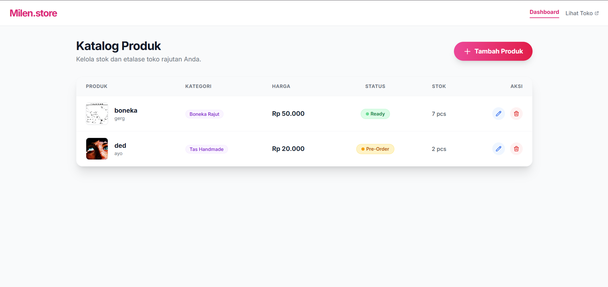

# Milen.store - Web Katalog Rajutan Handmade

**Milen.store** adalah aplikasi web manajemen katalog produk (CRUD) untuk toko rajutan handmade. Aplikasi ini dibangun untuk memudahkan admin mengelola stok dan menampilkan etalase produk yang menarik bagi pelanggan.

Dibuat sebagai proyek pembelajaran implementasi **Laravel 10/11** dengan antarmuka modern menggunakan **Tailwind CSS**.

## Fitur Unggulan

### Halaman Publik (Pelanggan)
* **Hero Banner & UI Modern:** Tampilan responsif dan estetis dengan nuansa warna Pink/Rose.
* **Katalog Grid:** Menampilkan daftar produk terbaru lengkap dengan harga dan badge status.
* **Integrasi WhatsApp:** Tombol "Beli" yang langsung mengarah ke chat WhatsApp penjual dengan pesan otomatis.
* **Indikator Stok:** Badge otomatis untuk status "Ready Stock" atau "Pre-Order".

### Halaman Admin (Dashboard)
* **CRUD Lengkap:** Fitur Tambah, Baca, Edit, dan Hapus data produk.
* **Image Management:**
    * Upload gambar produk dengan **Live Preview** sebelum disimpan.
    * Sistem otomatis hapus file gambar lama saat produk di-update atau dihapus (Storage Cleanup).
* **Validasi Data:** Mencegah input kosong atau format file yang salah.
* **Interaktif UI:**
    * **SweetAlert2:** Pop-up konfirmasi yang cantik saat menghapus data.
    * **Alpine.js:** Dropdown kategori dan status yang bisa dikustomisasi (warna hover pink).
    * **Toast Notification:** Notifikasi sukses saat data berhasil disimpan.

## Teknologi yang Digunakan

* **Backend:** [Laravel](https://laravel.com) (PHP Framework)
* **Frontend:** [Tailwind CSS](https://tailwindcss.com) (Styling), Blade Templates
* **Scripting:** [Alpine.js](https://alpinejs.dev) (Interaktivitas), Vite (Asset Bundling)
* **Database:** MySQL
* **Icons:** Heroicons

## Screenshots

| Dashboard Admin |
||

## Cara Instalasi (Run Locally)

Ikuti langkah ini untuk menjalankan proyek di komputer Anda:

1.  **Clone Repository**
    ```bash
    git clone [https://github.com/rifkyprataama/milen.store.git](https://github.com/rifkyprataama/milen.store.git)
    cd milen.store
    ```

2.  **Install Dependencies**
    ```bash
    composer install
    npm install
    ```

3.  **Setup Environment**
    * Duplikat file `.env.example` menjadi `.env`.
    * Atur konfigurasi database di file `.env`:
    ```env
    DB_DATABASE=
    DB_USERNAME=
    DB_PASSWORD=
    ```

4.  **Generate Key & Migrate**
    ```bash
    php artisan key:generate
    php artisan migrate
    ```

5.  **Setup Storage Link** 
    ```bash
    php artisan storage:link
    ```

6.  **Jalankan Server**
    Buka dua terminal terpisah:
    ```bash
    # Terminal 1
    php artisan serve

    # Terminal 2
    npm run dev
    ```

7.  **Buka Aplikasi**
    Akses `http://127.0.0.1:8000` di browser Anda.
    * Halaman Depan: `/`
    * Halaman Admin: `/products`

## Lisensi

Proyek ini bersifat open-source di bawah lisensi [MIT](https://opensource.org/licenses/MIT).

---
**Dibuat oleh [Rifky Pratama](https://github.com/rifkyprataama)**